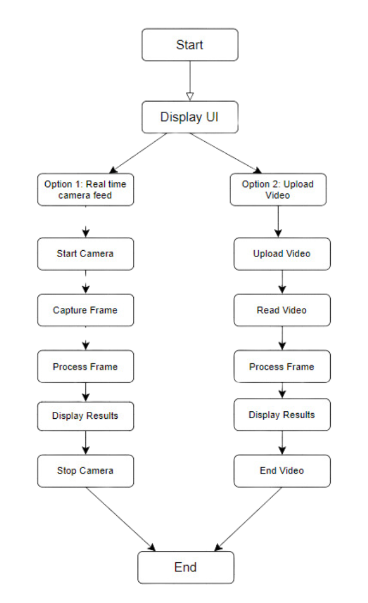
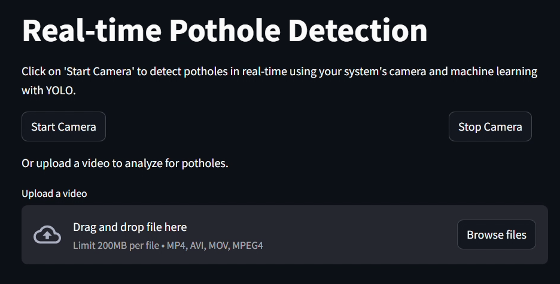
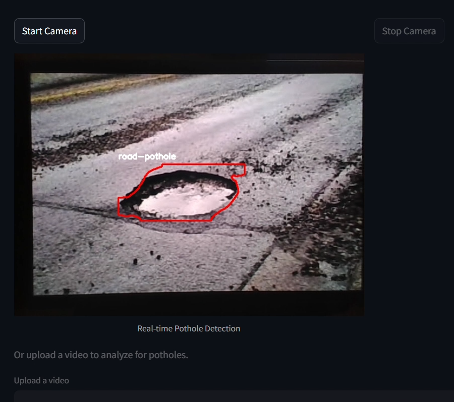
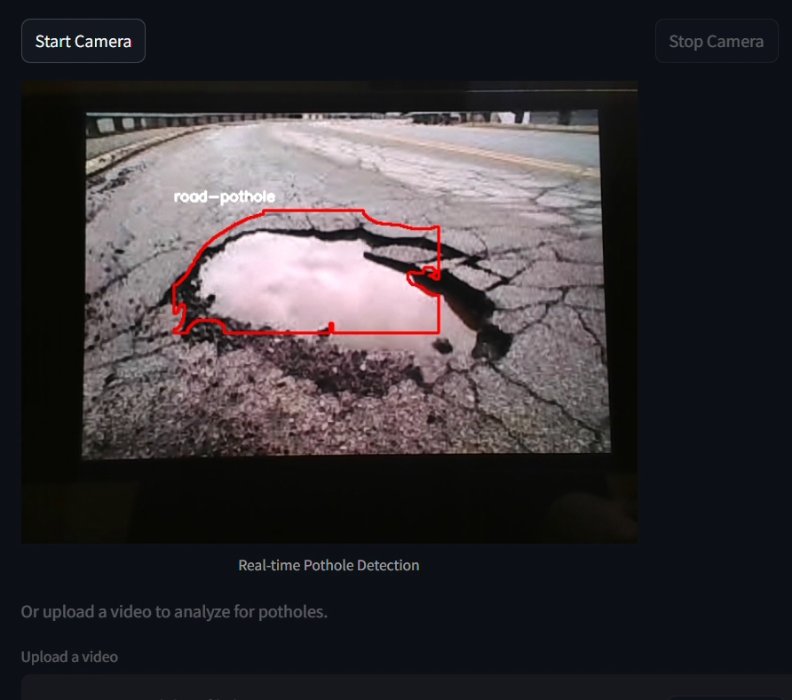
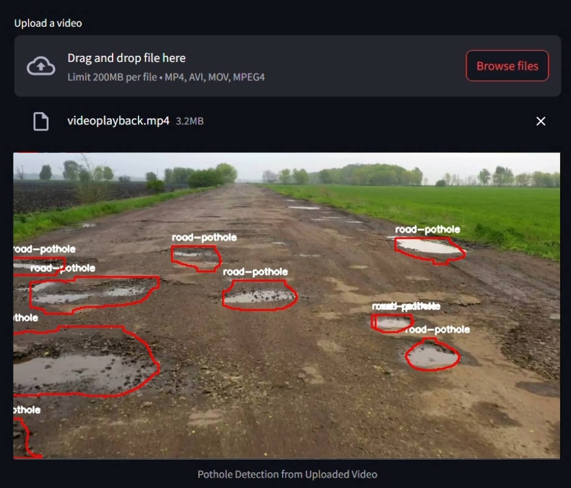

## 🕳️ Real-Time Pothole Detection using YOLO and Streamlit

---

This project demonstrates a real-time pothole detection system using the YOLOv8 object detection model integrated with a Streamlit web interface. It can detect potholes either through your system's camera or from an uploaded video file. The results are visualized with bounding boxes and segmentation masks drawn directly on the video frames.

### 🚀 Features

- ✅ Real-time pothole detection using webcam
- 📹 Analyze potholes in uploaded video files
- 🧠 Utilizes YOLOv8 model for object detection and segmentation
- 🖼️ Displays predictions with contours and labels on Streamlit UI
- 🔁 Processes every third frame for optimized performance

### 🛠️ Tech Stack

- YOLO
- OpenCV
- NumPy
- Streamlit
- Pillow (PIL)

### 📦 Requirements

Install dependencies using:

```bash
pip install -r requirements.txt
```

`requirements.txt` should include:
```txt
ultralytics
opencv-python
streamlit
Pillow
numpy
```

### 🧾 How It Works

1. Load a pre-trained YOLO model (`best.pt`) trained for pothole detection.
2. Either:
   - Start the webcam to detect potholes in real-time, or
   - Upload a video file for offline analysis.
3. The model performs object detection and segmentation.
4. Detected potholes are highlighted with contours and class labels.
5. Results are rendered in the Streamlit web UI.

### ▶️ Run the App

To launch the web app locally:

```bash
streamlit run final.py
```

> Make sure you have a trained `best.pt` YOLO model in the project directory.

### 📸 Screenshots

Here are some screenshots showcasing different aspects of the application:

#### 1. System Flow


#### 2. System UI


#### 3. Real-Time Potholes Detection through Camera



#### 3. Potholes Detection from Uploaded Video


---
